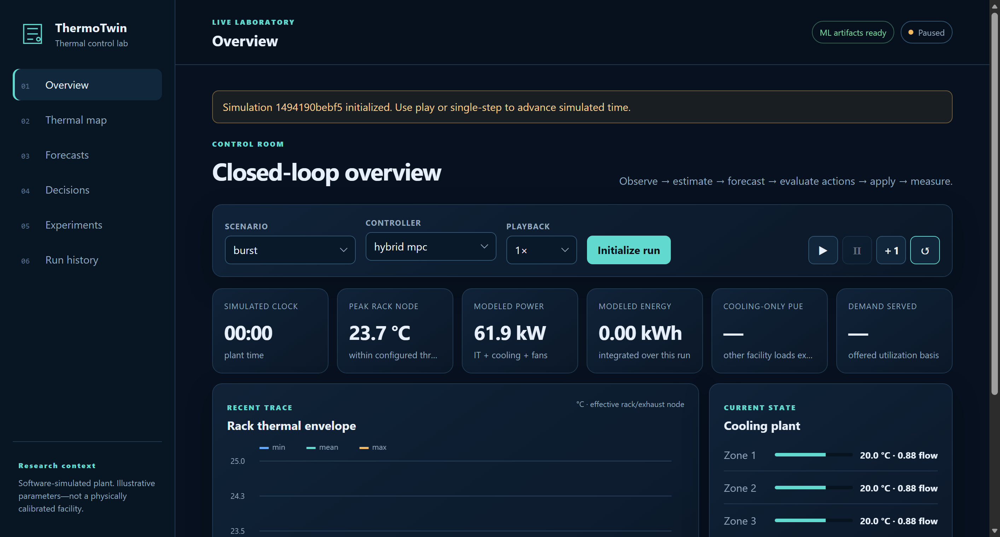
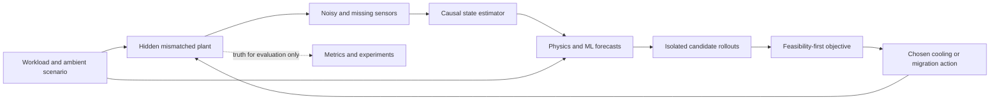
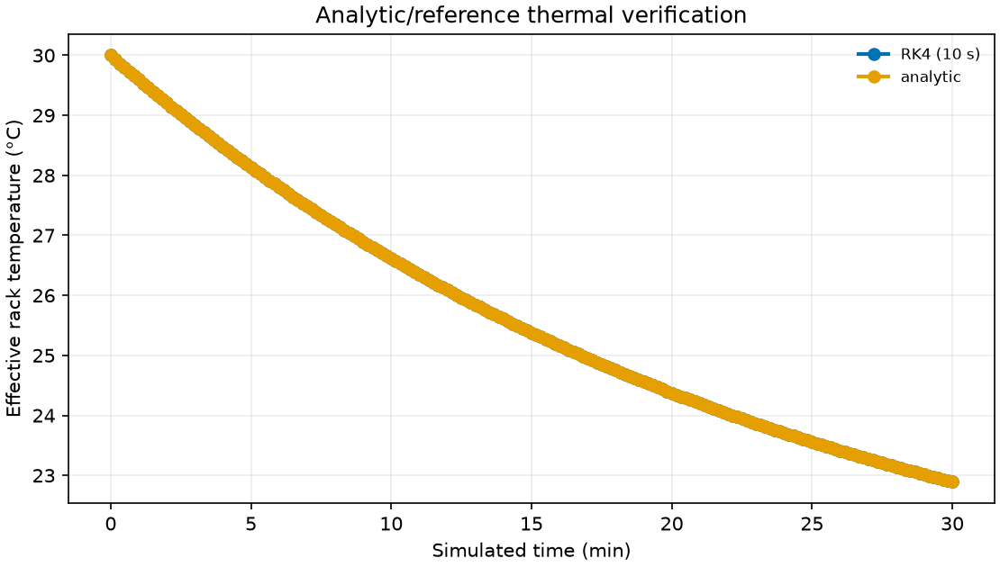
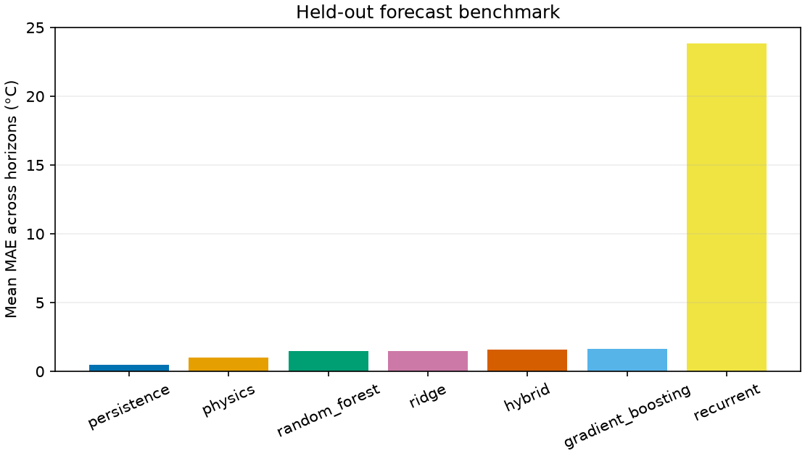
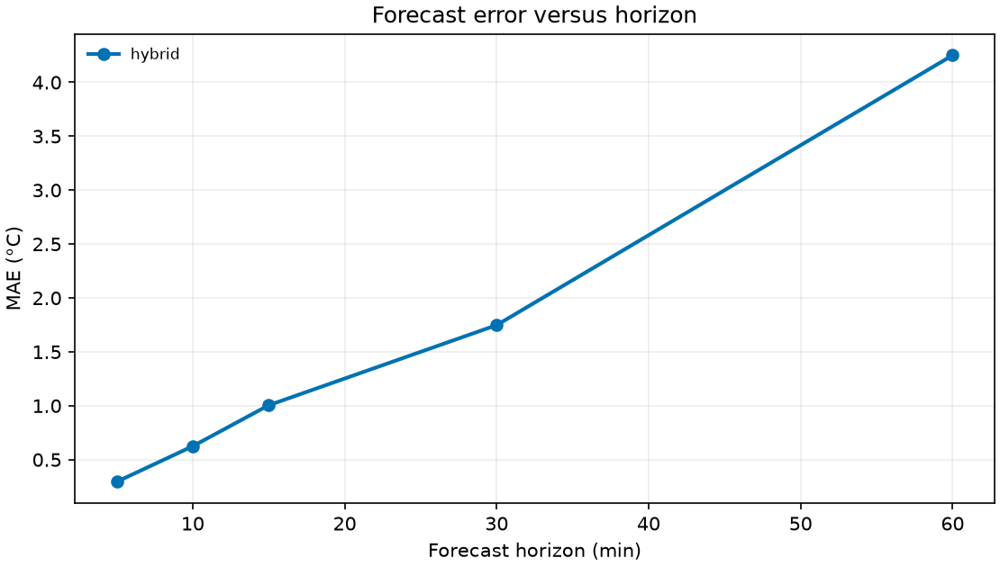
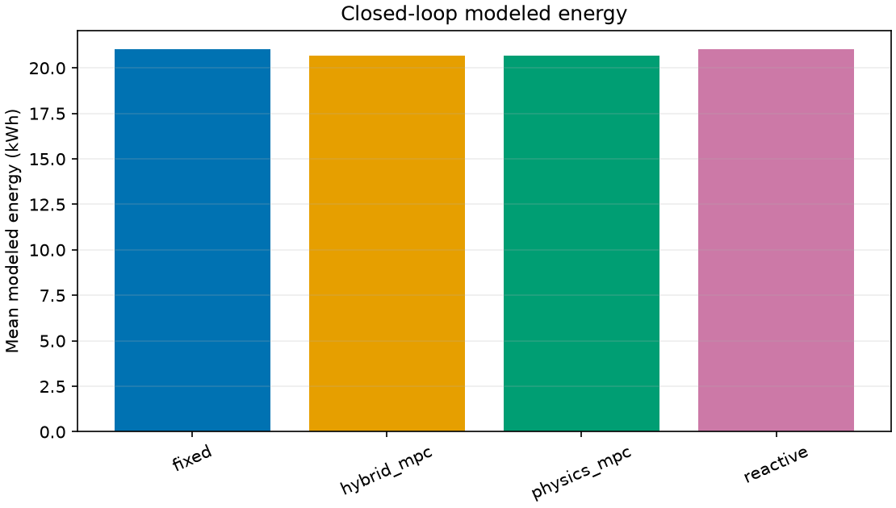
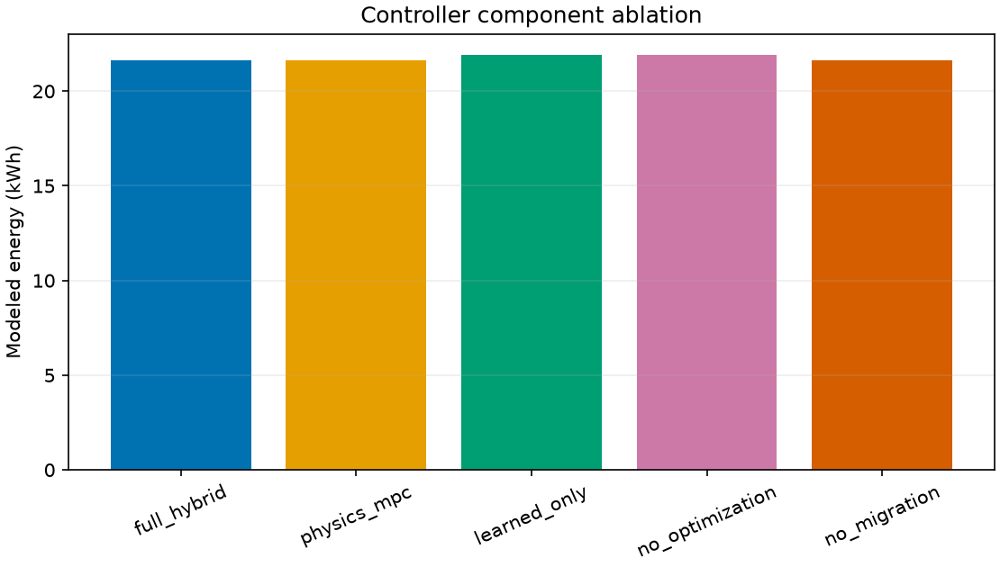
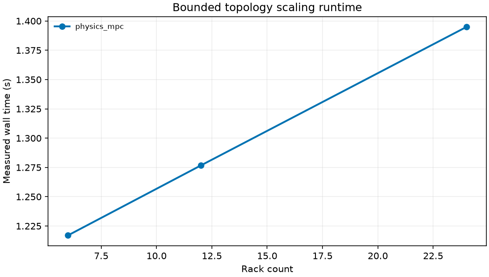

# ThermoTwin

<p align="center">
  <strong>A machine-learning-enhanced thermal digital twin for predictive control experiments in simulated data centres.</strong>
</p>

<p align="center">
  
  
  
  
  <a href="LICENSE"></a>
</p>

ThermoTwin combines a transparent rack-level thermal model, noisy and missing sensor observations, causal state estimation, multi-horizon forecasting, and feasibility-first predictive control. It includes seven forecasting paths, four controllers, six reproducible experiments, a local Flask API, an offline report generator, and a responsive control-room dashboard.

> [!IMPORTANT]
> ThermoTwin is a **software-simulated research surrogate**, not a digital twin calibrated against a physical facility. Its parameters and results are illustrative. They are not hardware measurements, guaranteed savings, safety certification, or an industry temperature standard.



## Contents

- [Highlights](#highlights)
- [Quick start](#quick-start)
- [How the closed loop works](#how-the-closed-loop-works)
- [Models and controllers](#models-and-controllers)
- [Experiments](#experiments)
- [Verified smoke results](#verified-smoke-results)
- [CLI and API](#cli-and-api)
- [Repository structure](#repository-structure)
- [Reproducibility](#reproducibility)
- [Testing](#testing)
- [Limitations](#limitations)

## Highlights

| Area | What is implemented |
| --- | --- |
| Plant | Configurable 6/12/24-rack, three-zone thermal system; RK4 integration; recirculation; inter-rack coupling; finite cooling capacity; actuator lag and slew limits |
| Observations | Noise, missingness, validity masks, causal estimation, and a strict separation between hidden simulated truth and policy-visible state |
| Forecasting | Persistence, nominal physics, ridge, random forest, gradient boosting, PyTorch GRU, and a physics-plus-learned-residual hybrid |
| Control | Fixed, reactive hysteresis, physics MPC-style search, and hybrid MPC-style search with cooling and workload-migration actions |
| Evaluation | Leakage-resistant chronological splits, purge gaps, held-out scenarios, interval calibration, hotspot-event metrics, ablation, robustness, and scale tests |
| Product | Responsive no-build frontend, live playback, thermal map, forecasts, candidate ledger, experiment jobs, cancellation, run history, and safe artifact downloads |
| Operation | Local-only runtime, bounded workers, cached fingerprint-matched preparation, reproducible seeds, manifests, and self-contained HTML reports |

The browser application uses plain HTML, CSS, and JavaScript: no Node.js, CDN, hosted font, telemetry service, account, or paid API is required.

## Quick start

Python 3.11 or newer is supported. Python 3.13.2 was used for the verified build. The first setup needs internet access to install Python packages; normal prepared operation is local.

### Windows PowerShell

```powershell
git clone <your-repository-url>
cd ThermoTwin

py -3.13 -m venv .venv
.venv\Scripts\python.exe scripts\bootstrap.py --profile smoke
python app.py
```

### macOS or Linux

```bash
git clone <your-repository-url>
cd ThermoTwin

python3 -m venv .venv
.venv/bin/python scripts/bootstrap.py --profile smoke
.venv/bin/python -m thermotwin serve --profile smoke
```

Open <http://127.0.0.1:5000> after the terminal prints `Running on http://127.0.0.1:5000`.

The first smoke preparation generates data, trains the models, executes six bounded experiments, and may take a few minutes on a CPU laptop. Later launches load the prepared artifacts. On the verified Windows machine, the Python/ML import phase took about 20–30 seconds and the initialization endpoints then answered in under 0.25 seconds.

For expanded setup, command, output, and troubleshooting notes, see [HOW_TO_RUN.txt](HOW_TO_RUN.txt).

## How the closed loop works



At each decision instant, the policy receives the current estimate and causal inputs—not hidden plant parameters, realized future disturbances, future workload samples, or test targets. It builds a deterministic bounded candidate set containing no-op, zone supply/airflow changes, feasible rack-to-rack workload migrations, combined actions, and maximum configured cooling.

Every viable candidate is simulated from a defensive snapshot. A rollout cannot advance live time, mutate policy memory, modify history, or consume the plant random-number stream. If a safe candidate exists, predicted hard-limit violations are rejected; otherwise an explicitly marked emergency fallback minimizes violation severity before soft cost.

### Thermal model

The primary state is an effective lumped rack/exhaust node, not a CPU junction temperature:

```text
C_i dT_i/dt = P_IT,i + Q_disturbance,i
              - H_i(m_i)(T_i - T_in,i)
              + Σ_j K_ij(T_j - T_i)
```

- `C_i` is effective thermal capacitance in J/K.
- `P_IT,i` combines idle and utilization-dependent dynamic power.
- `Q_disturbance,i` is hidden correlated unmodelled sensible heat.
- `H_i(m_i)` is airflow-dependent thermal conductance.
- Symmetric non-negative `K_ij` terms couple neighbouring racks and conserve internal energy.
- Rack inlet temperature is derived from zone supply and bounded recirculation.

Cooling commands and physical actuator states are separate. Supply temperature and airflow have first-order lag, bounds, and slew limits. Compressor and cubic fan electricity are accounted for exactly once. The reported PUE is a declared cooling-only approximation:

```text
PUE_cooling = (IT energy + cooling-and-fan energy) / IT energy
```

It excludes UPS, lighting, distribution, and other facility loads.

## Models and controllers

### Forecasting paths

All model families are fitted and evaluated on aligned targets at 5, 10, 15, 30, and 60 minutes.

| Model | Role |
| --- | --- |
| Persistence | Strong short-horizon reference baseline |
| Nominal physics | Transparent model-based forecast |
| Ridge | Scaled linear supervised baseline |
| Random forest | Nonlinear tree ensemble |
| Gradient boosting | Boosted nonlinear ensemble |
| GRU | Shared rack-level recurrent PyTorch model |
| Hybrid | Nominal transition plus learned action-conditioned residual |

Raw trajectories are split chronologically **before** window construction into train, validation, uncertainty-calibration, and test blocks. Purge gaps cover the largest forecast horizon plus lag window. Preprocessors and models fit training data only; validation selects models; calibration constructs empirical intervals; test data is reporting-only.

### Controllers

| Controller | Description |
| --- | --- |
| `fixed` | Holds the configured baseline cooling state |
| `reactive` | Current-temperature hysteresis baseline |
| `physics_mpc` | Bounded receding-horizon search with nominal physics |
| `hybrid_mpc` | The same action search with candidate-dependent learned residuals inside each rollout |

The optimizer is a bounded hold-first-action search, not an exact globally optimal MPC solver. Its normalized objective combines modeled energy, hotspot and hard-limit penalties, rack imbalance, actuator movement, and migration cost. Weights and reference scales are exposed in YAML.

## Experiments

The common experiment runner supports selection, resumption, cooperative cancellation, fingerprint-aware caching, raw CSV/JSON output, PNG/SVG figures, and a self-contained report.

| # | Experiment | Main question |
| ---: | --- | --- |
| 1 | Physics and numerics | Do analytic, conservation, lag, saturation, and timestep checks pass? |
| 2 | Forecast benchmark | How do seven forecast paths compare on identical held-out targets? |
| 3 | Horizon sensitivity | How do error, interval coverage, width, and hotspot-event metrics change with horizon? |
| 4 | Closed-loop control | How do four controllers behave across five shared scenarios? |
| 5 | Ablation | What changes when residual learning, physics, optimization, or migration is removed? |
| 6 | Robustness and scale | How does the system respond to mismatch, sensor faults, degradation, objective changes, and 6/12/24-rack topologies? |

Scenarios include `normal`, `burst`, `skewed`, `hot_ambient`, and `cooling_degradation`.

## Verified smoke results

The current publishable snapshot is run `20260909T164731Z-smoke-0f5c7fd7`:

| Evidence | Verified value |
| --- | ---: |
| Source fingerprint | `9cf0c2a9f0dff84b` |
| Configuration fingerprint | `8db2ca5397b47287` |
| Data fingerprint | `3d54ecaaf0d14d7f` |
| Model identifier | `b6af9ce31535df3c` |
| Physics/numerics checks | 8 / 8 passed |
| Experiments completed | 6 / 6 |
| Automated tests | 34 / 34 passed |
| Experiment-run wall time | 61.24 s |
| Browser acceptance | High-DPI chart stable; no severe console errors; 0 px mobile overflow |

In the one-replication smoke controller study, hybrid MPC averaged 20.678 kWh over the five 20-minute scenarios versus 21.008 kWh for fixed cooling: a paired difference of −0.330 kWh (−1.57%). All evaluated controller/scenario rows served 100% of offered utilization and recorded zero hotspot rack-minutes; the maximum effective rack-node temperature was 29.35 °C.

Persistence was the strongest held-out forecasting baseline at every tested smoke horizon (0.136 °C MAE at 5 minutes and 1.015 °C at 60 minutes). The smoke GRU is deliberately compute-bounded to two epochs and visibly underfits; it is included to verify the recurrent pipeline, not presented as a competitive result. The operational hybrid is used because its action-conditioned residual can participate inside controller rollouts, not because it won the held-out test ranking.

These figures verify pipeline behavior only. One smoke replication cannot support a confidence interval or publication-quality energy claim. The report therefore records the paired interval as unavailable rather than presenting decorative certainty.

<table>
  <tr>
    <td width="50%"></td>
    <td width="50%"></td>
  </tr>
  <tr>
    <td align="center"><sub>Physics and numerical verification</sub></td>
    <td align="center"><sub>Held-out forecast benchmark</sub></td>
  </tr>
  <tr>
    <td></td>
    <td></td>
  </tr>
  <tr>
    <td align="center"><sub>Horizon sensitivity</sub></td>
    <td align="center"><sub>Closed-loop controller comparison</sub></td>
  </tr>
  <tr>
    <td></td>
    <td></td>
  </tr>
  <tr>
    <td align="center"><sub>Controller ablation</sub></td>
    <td align="center"><sub>Topology scaling</sub></td>
  </tr>
</table>

The exact curated records are committed as [smoke-summary.json](docs/evidence/smoke-summary.json) and [smoke-manifest.json](docs/evidence/smoke-manifest.json). Full run directories and trained artifacts are intentionally generated locally and excluded from Git.

## Dashboard

The dashboard provides:

- scenario, controller, speed, play, pause, reset, and deterministic single-step controls;
- live clock, peak node temperature, power, energy, cooling-only PUE, and service KPIs;
- a responsive zone-grouped rack map with warnings, sensor state, inlet temperature, and utilization;
- aligned observed/physics/hybrid forecasts, empirical intervals, and a data table;
- the actual candidate ledger, objective components, constraints, chosen intervention, fallback explanation, and measured decision latency;
- bounded smoke/research background jobs with progress, logs, persistence, cancellation, and an explicit research-compute confirmation;
- completed run history and scoped downloads.

Canvas backing dimensions are device-pixel-ratio aware while CSS dimensions remain bounded, preventing the chart-resize feedback loop common in responsive canvases.

## CLI and API

After activating the virtual environment, or by prefixing commands with its Python executable:

```text
python -m thermotwin doctor --profile smoke
python -m thermotwin prepare --profile smoke [--force]
python -m thermotwin generate --profile smoke [--output PATH]
python -m thermotwin train --profile smoke [--input CSV] [--output DIR]
python -m thermotwin evaluate --profile smoke [--output CSV]
python -m thermotwin simulate --profile smoke --scenario burst --steps 30
python -m thermotwin experiments --profile smoke [--experiment 1 ...]
python -m thermotwin report RUN_ID
python -m thermotwin serve --profile smoke --port 5000
```

Implemented JSON endpoints:

```text
GET  /api/health                         GET  /api/config
POST /api/simulations                    GET  /api/simulations/<id>
POST /api/simulations/<id>/control       GET  /api/simulations/<id>/history
GET  /api/simulations/<id>/forecast      GET  /api/simulations/<id>/decisions
POST /api/jobs                           GET  /api/jobs
GET  /api/jobs/<id>                      POST /api/jobs/<id>/cancel
GET  /api/runs                           GET  /api/runs/<id>
GET  /api/runs/<id>/artifacts/<id>
```

The development service binds to `127.0.0.1` by default and has no authentication. Do not expose it directly to an untrusted network.

## Repository structure

```text
ThermoTwin/
├── app.py                    convenient local Flask launcher
├── configs/                  validated default, smoke, and research profiles
├── docs/
│   ├── assets/               curated dashboard and result figures
│   └── evidence/             curated smoke manifest and summary
├── scripts/bootstrap.py      editable install plus first-time preparation
├── src/thermotwin/
│   ├── control/              actions, constraints, objectives, policies, search
│   ├── data/                 generation, schema, causal features, temporal splits
│   ├── experiments/          six runners, statistics, plots, and reports
│   ├── forecasting/          baselines, GRU, hybrid residuals, calibration
│   ├── physics/              plant, twin, cooling, workload, observation
│   ├── services/             simulations, jobs, manifests, safe artifacts
│   └── web/                  Flask API and responsive local frontend
├── tests/                    scientific, ML, control, API, and browser checks
├── pyproject.toml            package metadata and dependencies
├── requirements*.txt         runtime and development requirements
└── LICENSE                   MIT license
```

### Generated and local-only paths

These paths are deliberately ignored and should not be pushed:

| Path | Purpose | Safe to regenerate? |
| --- | --- | --- |
| `.venv/` | Local Python environment | Yes |
| `artifacts/smoke/` | Generated dataset and trained model registry | Yes, with `prepare` |
| `artifacts/research/` | Extended-profile data and models | Yes |
| `artifacts/jobs/` | Background-job state and logs | Yes |
| `reports/` | Timestamped local experiment runs and reports | Yes |
| `__pycache__/`, `*.pyc` | Python bytecode cache | Yes |
| `.pytest_cache/`, `.test-tmp/` | Test-run cache and scratch space | Yes |
| `*.egg-info/`, `build/`, `dist/` | Packaging output | Yes |

The small `.gitkeep` placeholders retain required empty output directories in a fresh clone. The `docs/` figures and JSON files are curated evidence, not runtime caches, and should be committed.

## Reproducibility

Every run manifest records:

- UTC timestamp, run ID, profile, completion state, and measured wall time;
- resolved configuration and root/stream seeds;
- Python, platform, and relevant package versions;
- source, configuration, data, model, and run fingerprints;
- chronological split ranges and purge sizes;
- selected experiments and a safe artifact catalog.

Source hashing excludes generated outputs, environments, and caches, so executing a run does not invalidate its own provenance. A model or dataset is reused only when its fingerprints match the current profile and source requirements.

## Testing

Install development dependencies and run the suite:

```powershell
.venv\Scripts\python.exe -m pip install -e ".[dev]"
.venv\Scripts\python.exe -m pytest
```

The suite covers physics invariants, actuator behavior, workload conservation, data leakage guards, forecasting save/load fidelity, calibration, controller isolation and feasibility, metrics, API semantics, background-job cancellation, safe artifact resolution, and the end-to-end workflow.

The optional browser acceptance script requires a local Chromium/Edge installation and a running server:

```powershell
.venv\Scripts\python.exe tests\browser_smoke.py http://127.0.0.1:5000
```

## Limitations

- The plant is synthetic and has not been calibrated or validated against facility telemetry.
- A lumped rack node cannot represent component junction gradients, detailed airflow CFD, humidity/latent load, or electrical distribution losses.
- The estimator, exogenous forecast, learned models, finite candidate set, and short control horizon are deliberately compact CPU-oriented choices.
- Forecast error can accumulate recursively at long horizons; measured horizon degradation is reported rather than hidden.
- Predicted constraint satisfaction cannot guarantee physical safety under model mismatch.
- Utilization is normalized capacity, not application latency, queueing, or service-level behavior.
- Smoke mode uses one replication and is pipeline verification only. Run the research profile and independently review the methodology before drawing substantive conclusions.

## License

Copyright © 2026 Yatharth Garg. ThermoTwin is available under the [MIT License](LICENSE). Third-party dependencies retain their own licenses.
